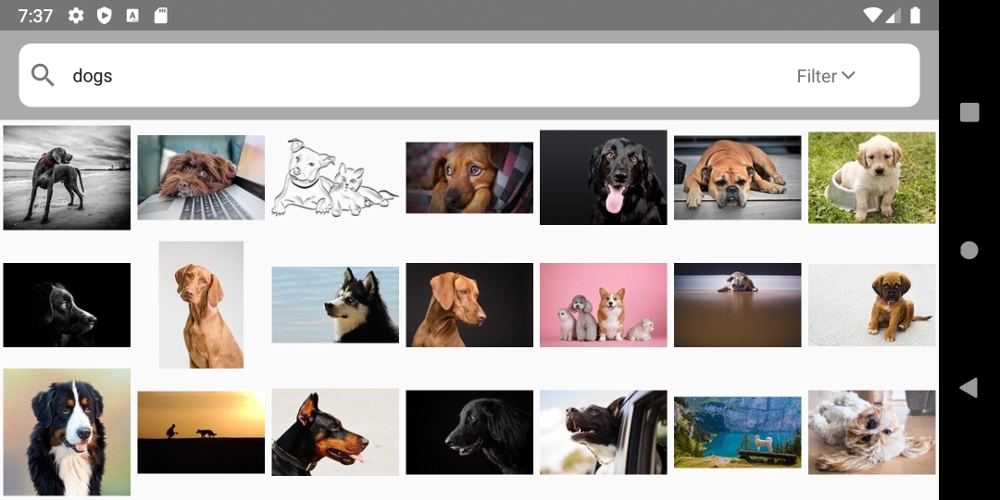
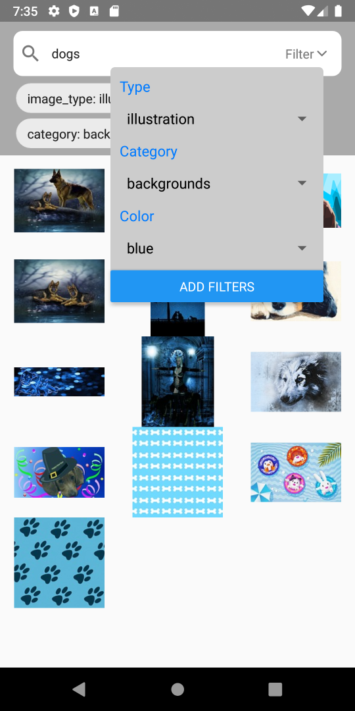

# Running the App

App was developed for Android. To run the app, you can either run it with an emulator via Android Studio or on an Android device via USB connection.

## Android Studio

Follow the instructions [here](https://reactnative.dev/docs/environment-setup) for setting up the dev environment and the React Native CLI.

Once you have the environment configured, navigate to the project root and use `npm run android` to start the development build.

## Android Device

To run the app on a physical Android device, follow the instructions [here](https://reactnative.dev/docs/running-on-device)

# Testing with Jest

Run tests with `npm run test`

# Screenshots

Landscape

  

Portrait - with filters applied

  